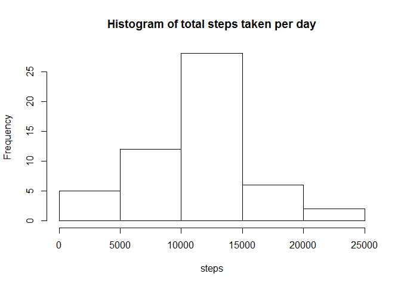
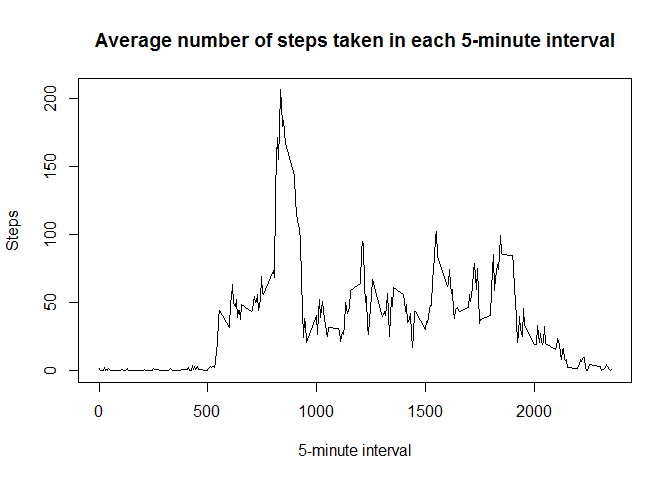
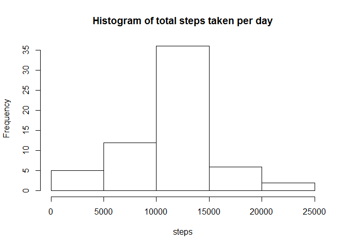
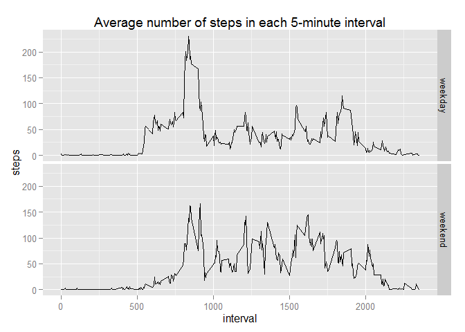

# Reproducible Research: Peer Assessment 1


## Loading and preprocessing the data

```r
activity<-read.csv("activity.csv")
activity$date<-as.Date(activity$date)
```
## What is the total number of steps taken per day?
Calculate the total number of steps taken per day

```r
steps<-rowsum(activity$steps,activity$date)
```
Make a histogram of the total number of steps taken each day

```r
hist(steps,main = "Histogram of total steps taken per day")
```

\
Calculate and report the mean and median total number of steps taken
per day

```r
mean(steps,na.rm = TRUE)
```

```
## [1] 10766.19
```

```r
median(steps,na.rm = TRUE)
```

```
## [1] 10765
```
## What is the average daily activity pattern?
Calculate average number of steps taken in each 5-minute interval

```r
averages<-aggregate(activity$steps~activity$interval,FUN = mean)
```
Make a time series plot of the 5-minute interval (x-axis) and the average number of steps taken, averaged across all days (y-axis)

```r
plot(averages$`activity$interval`,averages$`activity$steps`,
     type = "l",
     xlab = "5-minute interval",
     ylab = "Steps",
     main = "Average number of steps taken in each 5-minute interval")
```

\
Which 5-minute interval, on average accross all the days in the dataset, contains the maximum number of steps?

```r
averages[which.max(averages$`activity$steps`),1]
```

```
## [1] 835
```

## Imputing missing values
Calculate and report the total number of missing values in the dataset (i.e. the total number of rows with NAs)

```r
sum(!complete.cases(activity))
```

```
## [1] 2304
```
Create a new dataset equal to the original dataset, but with missing steps data replaced with the mean steps for the 5-minute interval corresponding to the missing value

```r
new_activity<-activity
for (i in 1:length(activity$steps)){
  if (is.na(activity$steps[i])==TRUE){
    new_activity$steps[i]<-mean(activity$steps[which(activity$interval==activity$interval[i])],na.rm = TRUE)
  }
}
```
Make a histogram of the total number of steps taken each day using the dataset with imputed values.

```r
new_steps<-rowsum(new_activity$steps,new_activity$date)
hist(new_steps,main = "Histogram of total steps taken per day",xlab = "steps")
```

\
Calculate and report the mean and median total number of steps taken per day using the dataset with imputed values.

```r
mean(new_steps)
```

```
## [1] 10766.19
```

```r
median(new_steps)
```

```
## [1] 10766.19
```
Using the dataset with imputed values the frequency of days with between 10,000 and 15,000 steps increased. The dataset with imputed values yielded the same mean number of steps taken per day; the median value increased by 1.19.
## Are there differences in activity patterns between weekdays and weekends?
Create a new factor variable in the dataset with two levels - "weekday" and "weekend" indicating whether a given date is a weekday or weekend day.

```r
new_activity$DayClass<-"weekday"
new_activity$DayClass[which(weekdays(new_activity$date)=="Sunday"|weekdays(new_activity$date)=="Saturday")]<-"weekend"
```
Make a panel plot containing a time series plot (I.e. type = "l") of the 5-minute interval (x-axis) and the average number of steps taken, averaged across all weekday days or weekend days (y-axis).

```r
#subset weekday and weekend data
weekdaydata<-new_activity[which(new_activity$DayClass=="weekday"),]
weekenddata<-new_activity[which(new_activity$DayClass=="weekend"),]
#calculate average steps in each interval for weekday and weekend data
averages_weekday<-aggregate(weekdaydata$steps~weekdaydata$interval,FUN = mean)
names(averages_weekday)<-c("interval","steps")
averages_weekday$DayClass<-"weekday"
averages_weekend<-aggregate(weekenddata$steps~weekenddata$interval,FUN=mean)
names(averages_weekend)<-c("interval","steps")
averages_weekend$DayClass<-"weekend"
new_averages<-rbind(averages_weekend,averages_weekday)
```

```r
library(ggplot2)
qplot(interval,steps,data=new_averages,facets = DayClass~.,geom = "line",main = "Average number of steps in each 5-minute interval",)
```

\
